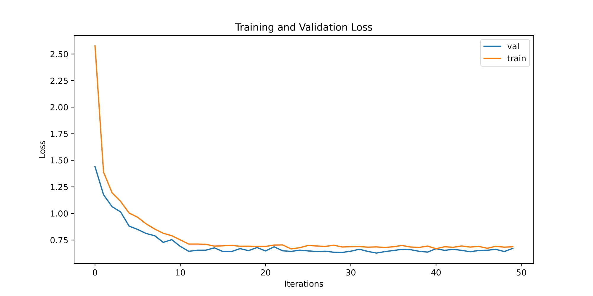
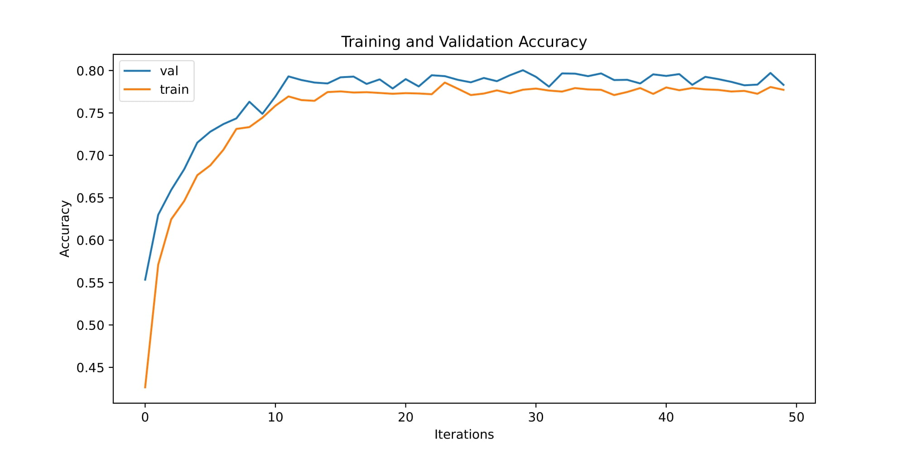
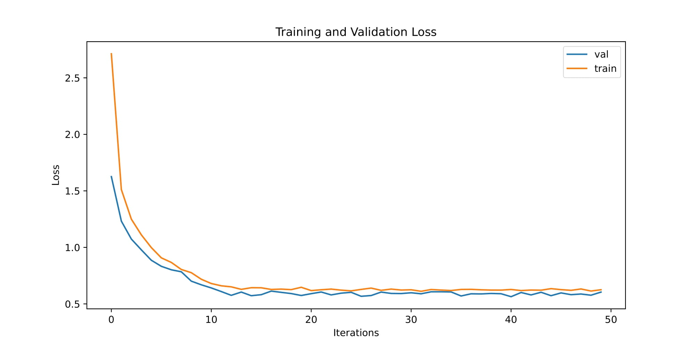
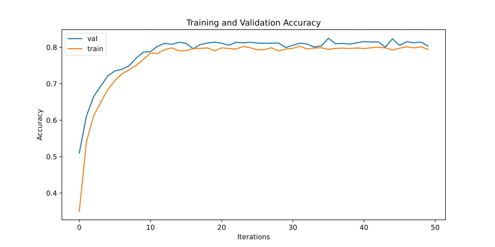
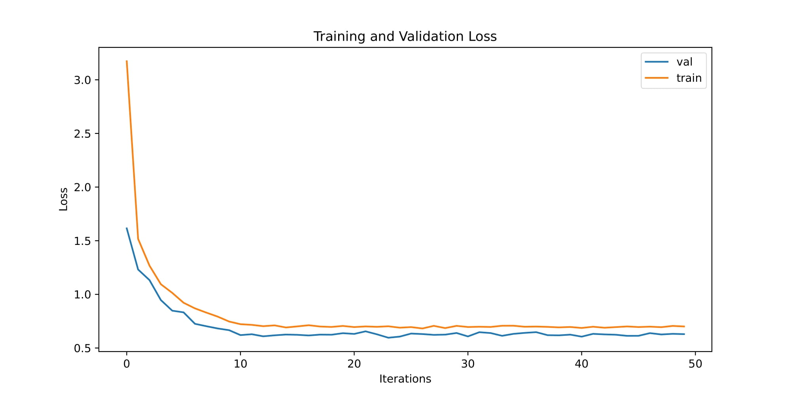
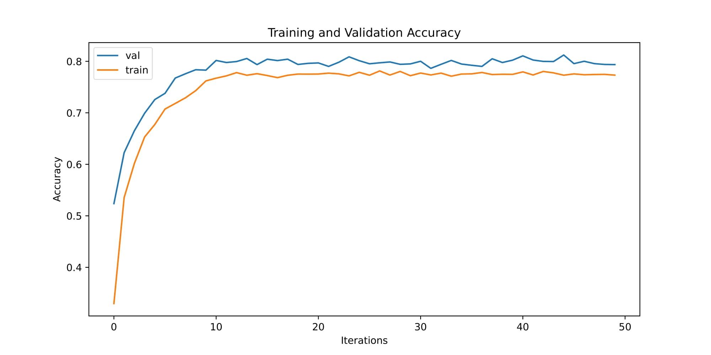
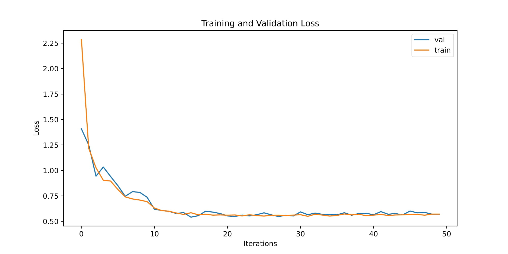
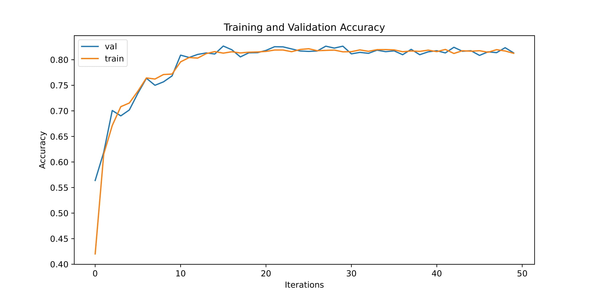
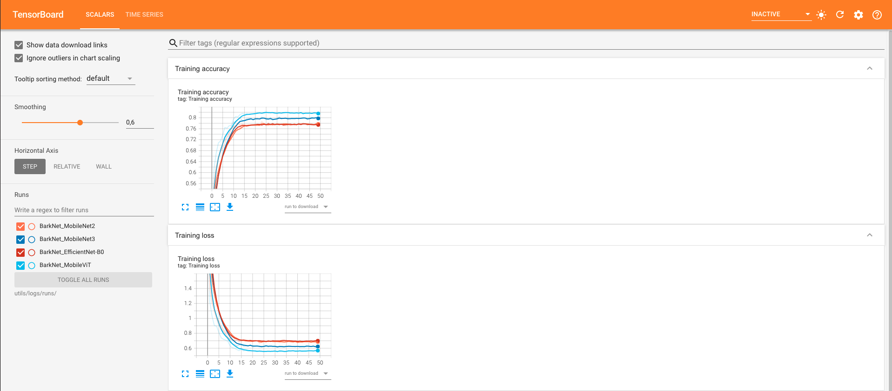

# Tree species identification using BarkNet 1.0 

In this repository, I am sharing how to do tree species identification using only an image of a bark. Please note that in this project, I didn't follow how the original authors splitted the data. For more details about data splitting or any other details, please refer to the [original paper](https://arxiv.org/pdf/1803.00949.pdf). 

# Dataset

The dataset contains 23 different species of trees found in parks and forests near Quebec City, Canada. It contains more than 23,000 images. The dataset were splitted as follow: 

Dataset | Train | Validation | Test
--- | --- | --- | ---
BarkNet 1.0 | 15,057 | 3,765 | 4,706 

# Models 

For this project, we have tested 4 models: MobileNet V2, MobileNet V3, EfficientNet-B0 and MobileViT.

# Results

Here are the obtained results:

Model | TOP-1 Accuracy | TOP-5 Accuracy
--- | --- | ---
MobileNet V2 | 78.83% | 97.69%
MobileNet V3 | 80.42% | 97.84% 
EfficientNet-B0 | 80.69% | 97.54%
MobileViT | 79.35% | 97.92%

# Loss and accuracy training 

## MobileNet V2

## MobileNet V3

## EfficientNet-B0

## MobileViT

# How to train the models on your own machine 

Run the project in background 
    
    nohup python main.py --model_name MobileNet2 > mobilenet2_nohup.out &
    nohup python main.py --model_name MobileNet3 > mobilenet3_nohup.out &
    nohup python main.py --model_name EfficientNet-B0 > efficientnet_b0_nohup.out &
    nohup python main.py --model_name MobileViT > mobilevit_nohup.out &

At the same time, you can run the following command to visualize the loss and accuracy while trainig using tensorboard

    tensorboard --logdir=utils/logs/runs/ --bind_all

Here how it looks like to visualize the training loss and accuracy

